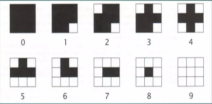
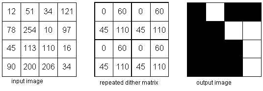

#### Laporan Tugas Pemrosesan Citra Digital Halftoning, Patterning dan Dithering

 **Dibuat oleh:**  M. Ikhwan Noor 2310131210005
 **Mata kuliah:**  Pemrosesan Citra Digital
 **Dosen Pengampu:**  Dr. Harja Santanapurba, M.Kom  Novan Alkaf B. S. S.Kom., M.T

 **PROGRAM STUDI PENDIDIKAN KOMPUTER  
FAKULTAS KEGURUAN DAN ILMU PENDIDIKAN  
UNIVERSITAS LAMBUNG MANGKURAT  
2024**

---

#### DAFTAR ISI

[PENDAHULUAN](#pendahuluan)

[PEMBAHASAN](#pembahasan)
1. Halftoning
    - Pengertian Halftoning
2. Patterning
    - Pengertian Patterning
    - Langkah-langkah patterning
    - Cara menghitung patterning
    - Contoh patterning
    - Algoritma Patterning
3. Dithering
   - Pengertian Dithering
    - Langkah-langkah Dithering
    - Cara menghitung Dithering
    - Contoh Dithering
    - Algoritma Dithering

[DAFTAR PUSTAKA](#dapus)

---

#### PENDAHULUAN

Pemrosesan citra digital merupakan salah satu bidang yang berkembang pesat seiring dengan kemajuan teknologi informasi dan komunikasi. Dengan meningkatnya penggunaan kamera digital, smartphone, dan perangkat pencitraan lainnya, pengolahan citra telah menjadi bagian integral dalam berbagai aplikasi, mulai dari pengenalan wajah hingga analisis medis. Tujuan utama dari pemrosesan citra digital adalah untuk meningkatkan kualitas gambar atau mengekstrak informasi yang berguna dari citra tersebut. Dalam tugas ini, kami akan mengeksplorasi berbagai teknik dan algoritma yang digunakan dalam pemrosesan citra. Dengan memahami konsep-konsep dasar dan aplikasinya, diharapkan dapat memberikan wawasan yang lebih dalam mengenai pentingnya pemrosesan citra dalam kehidupan sehari-hari dan berbagai industri.

---

#### PEMBAHASAN

##### 1. Halftoning
1. Pengertian Halftoning  
Proses yang menghasilkan pola biner titik-titik hitam dan putih dari sebuah gambar disebut halftoning. Ada 2 teknik dalam halftoning yaitu Patterning dan Dithering.
##### 2. Patterning  
1. Pengertian Patterning
Patterning adalah teknik halftoning digital sederhana yang melibatkan penggantian setiap piksel dengan pola yang diambil dari font biner.
2. Langkah-langkah Patterning
    * Mengkonversi gambar ke skala abu-abu
    * Memilih pattern berdasarkan tingkat keabuan.
    * Mengganti pixel dengan pattern yang ditentukan
    * Karena kita mengganti setiap pixel dengan blok pixel 3x3, lebar dan tinggi gambar meningkat 3 kali lipat

        

3. Cara menghitung Patterning
    * Menentukan tingkat keabuan dengan cara membagi 256 dengan 10 pattern yang ada.  
    * Hasilnya, pattern 0: 0-25, pattern 1: 26-51, pattern 3: 52-77, pattern 4: 104-129, pattern 5: 130-155, pattern 6: 156-181, pattern 7: 182-207, pattern 8: 208-233, pattern 9: 234-255.  
    * Mengganti pixel dengan tingkat keabuan yang cocok dengan pattern.  

4. Contoh Patterning
    * Contoh matrix 2x2:

            input gambar grayscale   mencocokkan tingkat keabuan dengan pattern

            [1, 24,                 [---------  ---------
            108, 41]       -->       pattern 0, pattern 0 
                                     ---------  ---------
                                     ---------  ---------
                                     pattern 4, pattern 1
                                     ---------  ---------]

5. Algoritma pada Patterning

        function halftone(image):
            // Ambil dimensi gambar
            width, height = getDimensions(image)
            
            // Buat gambar hasil dengan ukuran yang sama
            halftonedImage = createNewImage(width, height)
            
            // Tentukan pola 3x3 untuk 10 level
            patterns = [
                [[0, 0, 0], [0, 0, 0], [0, 0, 0]],  // Level 0
                [[0, 0, 0], [0, 0, 0], [0, 0, 1]],  // Level 1
                [[1, 0, 0], [0, 0, 0], [0, 0, 1]],  // Level 2
                [[1, 0, 1], [0, 0, 0], [0, 0, 1]],  // Level 3
                [[1, 0, 1], [1, 0, 0], [1, 0, 1]],  // Level 4
                [[1, 0, 1], [0, 0, 0], [1, 1, 1]],  // Level 5
                [[1, 0, 1], [1, 0, 0], [1, 1, 1]],  // Level 6
                [[1, 1, 1], [1, 0, 0], [1, 1, 1]],  // Level 7
                [[1, 1, 1], [1, 0, 1], [1, 1, 1]],  // Level 8
                [[1, 1, 1], [1, 1, 1], [1, 1, 1]]   // Level 9
            ]
            
            // Proses setiap piksel dalam gambar
            FOR y FROM 0 TO height-1:
                FOR x FROM 0 TO width-1:
                    // Ambil nilai intensitas piksel
                    intensity = getPixelIntensity(image, x, y)
                    // Normalisasi intensitas menjadi level 0-9
                    level = normalizeIntensity(intensity)
                    // Ambil pola yang sesuai
                    pattern = patterns[level]
                    // Tempatkan pola ke gambar hasil
                    PLACE pattern IN halftonedImage AT (x*3, y*3)
            
            RETURN halftonedImage

        FUNCTION normalizeIntensity(intensity):
            // Normalisasi dari 0-255 ke 0-9
            RETURN floor(intensity / 25.5) // 255 / 10 = 25.5

##### 3. Dithering

1. Pengertian Dithering  
Dithering menciptakan output gambar dengan jumlah titik yang sama dengan jumlah pixel pada gambar sumber. Dithering dapat dilakukan dengan membatasi gambar terhadap matriks dither.

3. Langkah-langkah Dithering
    - Elemen matriks dither adalah batasnya.
    - Matriks diletakkan seperti ubin di seluruh gambar dan setiap nilai pixel dibandingkan dengan batas yang sesuai dari matriks.
    - Pixel menjadi putih jika nilainya melebihi batas atau menjadi hitam jika sebaliknya.
4. Cara menghitung Dithering
    - Membandingkan matriks nilai pixel gambar dengan matriks dither sebagai batasnya
    - Jika pixel pada matriks gambar melebihi batas pada matriks dither, maka pixel tersebut menjadi putih dan sebaliknya
5. Contoh Dithering

        Matriks dither     Matriks gambar     Menghitung dither

        [0, 128            [243, 102,         [1, 0    243 > 0   ? = Putih (1)
        192, 64]            66,   12,]         0, 0]   102 > 128 ? = Hitam (0) 
                                                       192 > 66  ? = Hitam (0)
                                                       64  > 12  ? = Hitam (0)

    

6. Algoritma pada Dithering

        for all x & y do
            if f(x,y) > m(x,y)
                g(x,y) = 1 (white)
            else
                g(x,y) = 0 (black)
        
        variabel f adalah matriks dither
        variabel m adalah matriks gambar
        variabel g adalah matriks yang menyimpan output

---

#### DAFTAR PUSTAKA
The University of British Columbia. (n.d.). Digital Halftoning. Digital halftoning. https://people.ece.ubc.ca/irenek/techpaps/introip/manual04.html 

